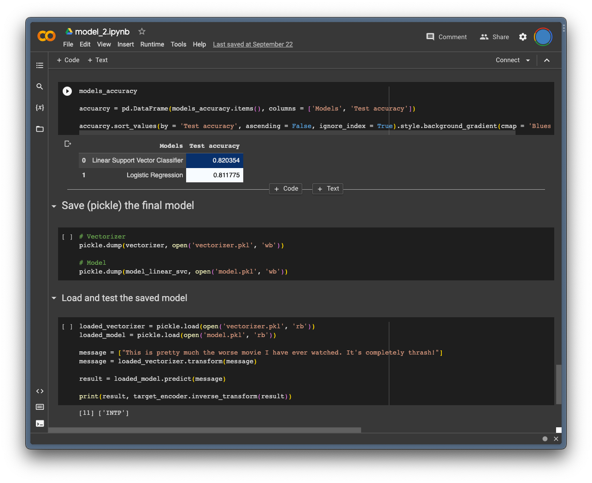
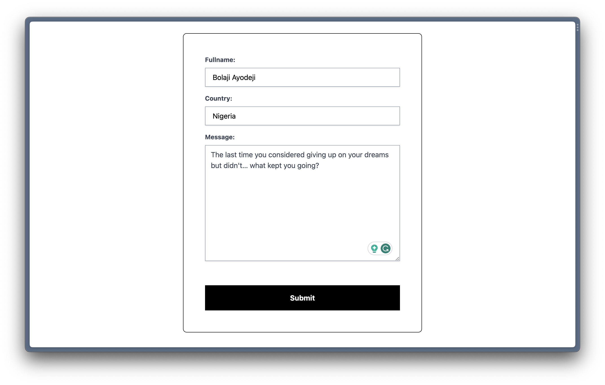

# Deploying Machine Learning Models to the Web

One essential and last phase of the CRISP-DM data framework is deployment. The key focus in this phase is the usability of the developed model by intended users or customers. Depending on the type of solution and use case, this can involve deploying and integrating the model on any medium like the web, a mobile application, a hardware-embedded system, etc. While this might "sound easy,” many beginner ML engineers find it daunting to deploy their projects on the web for their intended users to test and for their solutions to solve their users' problems.

In this workshop, Bolaji will introduce you to machine learning model deployment by showing you the steps and processes involved with turning a machine learning model into an API with Python and Flask,  testing the API with Postman, building a web application, and deploying it to the cloud for global usage. We would also discuss several other alternative Python/JavaScript frameworks and tools to consider.

---

<div align="center">


</div>

---

## Table of Contents

- [🎧 Overview](#-overview)
- [🛠 Prerequisites and Installation Guide](#-prerequisites-and-installation-guide)
- [📚 Workshop Lessons](#-workshop-lessons)
- [🚀 What's Next?](#-whats-next)
- [📑 Further Resources](#-further-resources)
- [👩🏽‍💻 Contributors Guide](#-contributors-guide)
- [⚖️ License](#️-license)

---

This repository contains the workshop materials, lesson notes, machine learning model notebooks, serilized models, backend API/web application code, and links to further resources. You can follow the workshop lessons and build the project yourself or use the materials to learn at your own pace.

In this workshop, we will build the following:

- A simple machine learning model that predicts the personality type of an individual using Python, Scikit-learn, and other libraries.
- A backend and API for the model using Python and Flask.
- A web application that consumes the model/API using HTML, CSS, JavaScript, and Flask.
- A web application and API that consumes the model/API using HTML, CSS, JavaScript, Nextjs, and Flask.

You can test the deployed applications here:

- `flask-api`: <https://mbpti-flask-api.fly.dev>.
- `flask-app`: <https://mbpti-flask-app.fly.dev>.






---

## 🎧 Overview

**Workshop duration**: ~three (3) hours.

At the end of this workshop; you should be able to:

- Explain what machine learning and a machine learning model are to your friends and family.
- Understand how the CRISP-DM data framework works.
- Understand the fundamentals of building a machine learning model using the Python programming language.
- Understand how to serialize (export/import) a machine learning model.
- Understand how to turn a machine learning model into an API using the Flask Python framework.
- Understand how to build a web application using the Flask Python framework.
- Understand how to build a web application using the Nextjs JavaScript framework.
- Understand how to deploy a Python/Flask application to the cloud using Fly.
- Understand how to deploy a Nextjs/Flask application to the cloud using Vercel.

---

This workshop has been presented at the following events:

- [React Alicante 2023](https://reactalicante.es/#schedule?utm_source=ba-deploy-ml-web-workshop) in Alicante, Spain 🇪🇸.
- Your next event or conference? You can invite me by [sending a message](https://twitter.com/iambolajiayo).

## 🛠 Prerequisites and Installation Guide

Generally, you need the following:

- A curious mind and desire to learn.
- An understanding of or familiarity with the first five phases of the CRISP-DM data-mining framework.
- A working laptop running on any operating system (Windows, Linux, or macOS).
- Ability to navigate through the command-line interface (CLI).
- Some existing machine learning model development knowledge (or an interest at least).
- Some basic understanding of the Python programming language.
- Some basic understanding of the JavaScript programming language.
- Experience using Reactjs and Nextjs frameworks.

To make the workshop a smooth process, we will use [Google Colab](https://colab.google?utm_source=ba-deploy-ml-web-workshop) for the machine learning model development. This will enable us to run a hosted Jupyter Notebook on the cloud (with GPU and TPU computing resources) and avoid issues with installing all the Python packages locally (the future is cloud!). All you have to do is create a free Google account if you don't have one already and open the Notebook in Google Colab.

But if you prefer local (I strongly advise against this; at least for this workshop), you should install [Anancoda](https://anaconda.com/download?utm_source=ba-deploy-ml-web-workshop) to use Jupyter Notebook on your local computer. You will need to install and import all the required packages yourself too and resolve any conflicts that might arise.

> [!NOTE]
>
> [Jupyter Notebooks](https://jupyter.org?utm_source=ba-deploy-ml-web-workshop) allow you to combine executable code and rich text in a single document, along with images, HTML, LaTeX, and more.

---

You should have the following software and packages installed on your computer. Kindly follow the guide in each toggle to install them.

<details>

<summary>Git and GitHub</summary>
<br />

We will install/use the following packages:

- [Git](https://github.com/pallets/flask?utm_source=ba-deploy-ml-web-workshop): a free and open-sourced distributed version control system.
- [GitHub](https://github.com?utm_source=ba-deploy-ml-web-workshop): a code hosting platform for version control and collaboration.

Download and install Git from [this website](https://git-scm.com/downloads?utm_source=ba-deploy-ml-web-workshop) for all operating systems or follow this [installation guide](https://git-scm.com/book/en/v2/Getting-Started-Installing-Git?utm_source=ba-deploy-ml-web-workshop).

Once installed successfully, confirm the version using the command:

```bash
git --version
```

<br />

Next, create a [free GitHub account](https://github.com/signup?utm_source=ba-deploy-ml-web-workshop) if you don't have one already.

> [!NOTE]
>
> Bonus: If you're a student, you should check out the [GitHub Student Developer Pack](https://education.github.com/pack?utm_source=ba-deploy-ml-web-workshop), which gives students free access to the best developer tools (paid tools/services/courses for free) in one place so they can learn by doing.

</details>

<details>

<summary>Postman Desktop App or VSCode Extension</summary>
<br />

We will install any of the following:

- [Postman Desktop App](https://github.com/pallets/flask?utm_source=ba-deploy-ml-web-workshop): a desktop that allows you use Postman to send API requests.
- [Postman VSCode Extension](https://github.com?utm_source=ba-deploy-ml-web-workshop): a VSCode extension that allows you use Postman to send API requests from within VS Code.

Download and install the Postman Desktop Client or VSCode Extension from [this website](https://www.postman.com/downloads?utm_source=ba-deploy-ml-web-workshop) for all operating systems.

</details>

<details>

<summary>Python and PIP</summary>
<br />

We will install the following packages:

- [Python](https://python.org?utm_source=ba-deploy-ml-web-workshop): a general-purpose programming language that lets you work quickly and integrate systems more effectively.
- [PIP](https://pypi.org/project/pip?utm_source=ba-deploy-ml-web-workshop): a package manager for installing Python packages or modules.

Download and install Python 3 (`>3.10.12`) from [this website](https://python.org/downloads?utm_source=ba-deploy-ml-web-workshop) for all operating systems (this will come with PIP in-built).

> [!IMPORTANT]
>
> Please specifically download and install a version `3.10.12` or higher (I'm using `3.11.5`). Google Colab will install version `3.10.12` which we will use to develope a machine learning model and anything less on your local machine will result in errors when using the serilized model.

Once installed successfully, confirm the version using the command:

```bash
python3 --version
```

If Python is installed correctly, you should have PIP installed. If it isn't, follow the steps in [this guide](https://pip.pypa.io/en/stable/installation?utm_source=ba-deploy-ml-web-workshop) to install PIP.

</details>

<details>

<summary>Other Python Packages</summary>
<br />

We will install the following packages:

- [Python Dotenv](https://pypi.org/project/python-dotenv?utm_source=ba-deploy-ml-web-workshop): a package that reads key-value pairs from a `.env` file and can set them as environment variables.
- [Scikit-Learn](https://scikit-learn.org/stable?utm_source=ba-deploy-ml-web-workshop): a free software machine learning library for the Python programming language, including various classification, regression, and clustering algorithms.
- [Flask](https://github.com/pallets/flask?utm_source=ba-deploy-ml-web-workshop): a lightweight Python micro framework for building web applications.
- [Gunicorn](https://gunicorn.org?utm_source=ba-deploy-ml-web-workshop): a Python WSGI HTTP Server for UNIX.

> [!IMPORTANT]
>
> Eventually, we will install the above mentioned libraries in a [virtual environment](https://packaging.python.org/en/latest/guides/installing-using-pip-and-virtual-environments/#creating-a-virtual-environment?utm_source=ba-deploy-ml-web-workshop) to ensure we use independent groups of Python libraries for each project. This is a recommended practice when building Python aplications in both development and production.

In the project directory, create the environment with the command `python3 -m venv .venv` and activate the envirnment with the command `source .venv/bin/activate`.

Now, install all of the packages using the command below:

```bash
pip3 install python-dotenv scikit-learn flask gunicorn
```

<br />

Once installed successfully, confirm the version using the command:

```bash
pip3 show python-dotenv

pip3 show scikit-learn

pip3 show flask

pip3 show gunicorn
```

</details>

<details>

<summary>Nodejs and NPM</summary>
<br />

We will install the following packages:

- [Nodejs](https://nodejs.org?utm_source=ba-deploy-ml-web-workshop): an open-source, cross-platform JavaScript runtime environment.
- [NPM](https://npmjs.com?utm_source=ba-deploy-ml-web-workshop): a package manager for installing JavaSript packages or modules.

Download and install Nodejs and NPM from [this website](https://nodejs.org/en/download?utm_source=ba-deploy-ml-web-workshop) for all operating systems or follow this [installation guide](https://docs.npmjs.com/downloading-and-installing-node-js-and-npm?utm_source=ba-deploy-ml-web-workshop).

Once installed successfully, confirm the version using the command:

```bash
node --version

npm --version
```

</details>

<details>

<summary>Reactjs and Nextjs</summary>
<br />

We will install the following packages:

- [Reactjs](https://react.dev?utm_source=ba-deploy-ml-web-workshop): an open-source web and native JavaScript library for building user interfaces.
- [Nextjs](https://nextjs.org?utm_source=ba-deploy-ml-web-workshop): an open-source React web development framework.

Automatically create a project with the latest version of Reactjs18 and Nextjs13 using the `create-next-app` command below:

```bash
npx create-next-app@latest
```

Consider reading Reactjs's [installation guide](https://react.dev/learn/installation?utm_source=ba-deploy-ml-web-workshop) to learn more.

</details>

<details>

<summary>Flyctl and Vercel</summary>
<br />

We will install the following packages:

- [Flyctl](https://fly.io/docs/hands-on/install-flyctl?utm_source=ba-deploy-ml-web-workshop): the command-line utility that lets you work on Fly from your terminal locally.
- [Vercel](https://vercel.com?utm_source=ba-deploy-ml-web-workshop): a frontend cloud platform for deploying web apps.

Sign up for a free account on [Fly.io](https://fly.io/app/sign-up) and [Vercel](https://vercel.com/signup?utm_source=ba-deploy-ml-web-workshop) if you haven't yet. Next, read [this guide](https://fly.io/docs/hands-on/install-flyctl) to install `flyctl` for any operating system.

</details>

## 📚 Workshop Lessons

1. [Introduction to Machine Learning](./lessons/01.md)
2. [Building a ML Model with Python](./lessons/02.md)
3. [Building an API for the ML Model](./lessons/03.md)
4. [Building a Web Application for the API](./lessons/04.md)
5. [Overview of Alternative Frameworks](./lessons/05.md)
6. [Building a Nextjs Web Application for the ML Model](./lessons/06.md)
7. [Deploying the API and Web Application to the Cloud](./lessons/07.md)
8. Bonus: Building Web AI Applications with Pre-trained Models (LLMs) and Vercel AI SDK (Coming soon!)

## 🚀 What's Next?

- Challenge: as discussed in [lesson seven](./lessons/07.md), update the `flask-api` app to support CORS, change how we get the request data, deploy to Fly again, and then use the live API directly in the Nextjs app.
- Build something nice for fun to test all you've learned, open-source the code, and write about it if you want.
- Here's a [list of different projects](https://github.com/BolajiAyodeji/deploy-ml-web-workshop/discussions/categories/projects) built by participants of this workshop. If you've built something nice, feel free to [create a new discussion](https://github.com/BolajiAyodeji/deploy-ml-web-workshop/discussions/new?category=projects) and talk about your project.
- Tag me on X (Twitter) [@iambolajiayo](https://twitter.com/iambolajiayo) when you share your project.
- Open an issue in this repository or DM me [@iambolajiayo](https://twitter.com/iambolajiayo) if you have any questions or need help with anything.

## 📑 Further Resources

- [My Weekly Newsletter](https://bawd.bolajiayodeji.com?utm_source=ba-deploy-ml-web-workshop)
- [Myers–Briggs Type Indicator](https://en.wikipedia.org/wiki/Myers%E2%80%93Briggs_Type_Indicator?utm_source=ba-deploy-ml-web-workshop)
- [How to Deploy a Machine Learning Model to the Web](https://blog.bolajiayodeji.com/how-to-deploy-a-machine-learning-model-to-the-web?utm_source=ba-deploy-ml-web-workshop)
- [Google's Machine Learning Crash Course](https://developers.google.com/machine-learning/crash-course?utm_source=ba-deploy-ml-web-workshop)
- [Google's Machine Learning Glossary](https://developers.google.com/machine-learning/glossary?utm_source=ba-deploy-ml-web-workshop)
- [Reading and Writing Files in Python](https://docs.python.org/3/tutorial/inputoutput.html#reading-and-writing-files?utm_source=ba-deploy-ml-web-workshop)
- [Flask Quickstart Guide](https://flask.palletsprojects.com/en/2.3.x/quickstart?utm_source=ba-deploy-ml-web-workshop)
- [Handling Flask Application Errors](https://flask.palletsprojects.com/en/2.3.x/errorhandling?utm_source=ba-deploy-ml-web-workshop)
- [List of HTTP status codes](https://en.wikipedia.org/wiki/List_of_HTTP_status_codes?utm_source=ba-deploy-ml-web-workshop)
- [Nextjs Forms and Mutations](https://nextjs.org/docs/pages/building-your-application/data-fetching/forms-and-mutations?utm_source=ba-deploy-ml-web-workshop)
- [Using the Python Runtime with Serverless Functions](https://vercel.com/docs/functions/serverless-functions/runtimes/python?utm_source=ba-deploy-ml-web-workshop)
- [Flask CORS Extension](https://flask-cors.readthedocs.io/en/latest/api.html?utm_source=ba-deploy-ml-web-workshop)
- [Builders and Fly](https://fly.io/docs/reference/builders?utm_source=ba-deploy-ml-web-workshop)

## 👩🏽‍💻 Contributors Guide

1. Fork [this repository](https://github.com/BolajiAyodeji/deploy-ml-web-workshop) (learn how to do this [here](https://help.github.com/articles/fork-a-repo)).

2. Clone the forked repository like so:

```bash
git clone https://github.com/<your username>/deploy-ml-web-workshop.git && cd deploy-ml-web-workshop
```

3. Make your changes and create a pull request ([learn how to do this](https://docs.github.com/en/github/collaborating-with-issues-and-pull-requests/creating-a-pull-request)).

4. I will attend to your pull request, provide some feedback, request some changes or eventually merge the PR!

## ⚖️ License

This repository is published under the [MIT](LICENSE) license.

---

<div align="center">

&copy; [Bolaji Ayodeji](https://bolajiayodeji.com)

</div>
