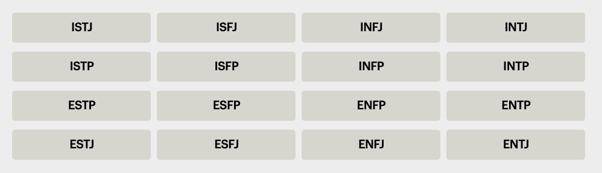
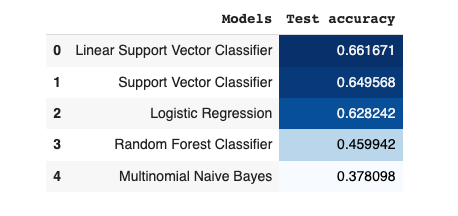
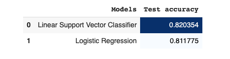

# Building a Machine Learning Model with Python

---

## Table of Contents

- [Overview](#overview)
- [Dataset](#dataset)
- [Technologies](#technologies)
- [Notebook (source code)](#notebook-source-code)
- [Glossary](#glossary)
- [Confusion Matrix](#confuison-matrix)

---

## Overview

We're going to build a machine learning model that will predict the personality type of an individual using the 16 distinct personality types from [Myers-Briggs Personality Type Indicator (MBPTI)](https://www.myersbriggs.org/my-mbti-personality-type/myers-briggs-overview?utm_source=ba-deploy-ml-web-workshop). _Isabel Myers_ and her mother _Katherine Briggs_ developed a questionnaire indicating differing psychological preferences in how people perceive the world and make decisions. The Myers-Briggs framework aims to help people identify and gain some understanding of how they take in information and make decisions (perception and judgment) in relation to their environment.

The framework consists of eight preferences organized into four pairs of opposites:

| Pair | Description |
| ---- | ----------- |
| Extraversion (**E**) or Introversion (**I**) | Direct and receive energy |
| Sensing (**S**) or Intuition (**N**) | Take in information |
| Thinking (**T**) or Feeling (**F**) | Decide and come to conclusions |
| Judging (**J**) or Perceiving (**P**) |Approach the outside world |

Combining the preferences (**E** or **I**, **S** or **N**, **T** or **F**, **J** or **P**) makes up a four-letter code MBTI type as seen in the image below. These types represent a person's psychological or personality type. There are 16 possible combinations of letters leading to 16 distinct MBTI personality types.

<div align="center">



[~Image source](https://www.myersbriggs.org/my-mbti-personality-type/myers-briggs-overview?utm_source=ba-deploy-ml-web-workshop)

</div>

> "Whatever the circumstances of your life, the understanding of type can make your perceptions clearer, your judgments sounder, and your life closer to your heart's desire." —Isabel Briggs Myers

## Dataset

We'll use two data sets sourced from Kaggle, as described in the sections below.

### One

The [first dataset](https://kaggle.com/datasets/datasnaek/mbti-type?utm_source=ba-deploy-ml-web-workshop) (26 MB) contains **8,675** rows of uncleaned data (individual posts collected from a forum and labelled with the personality type). This will allow us to learn the fundamentals of pre-processing data and data visualization. You can [download the file](../data/mbpt_dataset.csv) (`mbpt_dataset.csv`) in this repository or directly from the linked Kaggle page above.

The data is in a CSV file with the following columns:

| Column | Description |
| ------ | ----------- |
| `type` | Four-letter MBTI code. |
| `posts` | The last 50 things an individual posted with each entry separated by three pipe characters (&#124; &#124; &#124;). |

### Two

The resulting model from the first data set will not be optimal due to an imbalance in the data; hence, we will use the [second dataset](https://kaggle.com/datasets/zeyadkhalid/mbti-personality-types-500-dataset?utm_source=ba-deploy-ml-web-workshop) (346 MB) which contains **106,067** rows of cleaned and more balanced data. This dataset combines the first dataset and another one collected from Reddit and will give us much better accuracy. You can [download the file](https://drive.google.com/file/d/1WDJB_FI9QOaP572fdTbn2_lNaqDb63JE/view?usp=sharing) (`mbpt_dataset_2.csv`) or directly from the linked Kaggle page above. Since the file is large, I couldn't upload it to this repository (it exceeds GitHub's file size limit of 100.00 MB), so you can add it as a shortcut to your Google Drive. This way, you don't have to download the file and can easily mount it to your Colab session.

The data is in a CSV file with the following columns:

| Column | Description |
| ------ | ----------- |
| `type` | Four-letter MBTI code. |
| `posts` | Equal-sized words per sample of the last 50 things an individual posted. |

## Technologies

We'll build our model using the [Scikit-Learn](https://scikit-learn.org/stable/) library. Scikit-Learn is a free software machine learning library for the Python programming language, including various classification, regression, and clustering algorithms.

Here's a list and summary of each Python package we will use:

| Package | Description |
| ------- | ----------- |
| [`re`](https://docs.python.org/3/library/re.html) | Python built-in module for regular expression operations. |
| [`tqdm`](https://pypi.org/project/tqdm) | A fast and extensible progress bar. |
| [`pandas`](https://pypi.org/project/pandas) | A fast, powerful, flexible and easy-to-use data analysis and manipulation tool. |
| [`matplotlib.pyplot`](https://matplotlib.org/3.5.3/api/_as_gen/matplotlib.pyplot.html) | The state-based interface to matplotlib—the comprehensive library for creating static, animated, and interactive visualizations (more like an API for matplotlib making it a viable alternative to MATLAB). |
| [`WordCloud`](https://pypi.org/project/wordcloud) | A word cloud generator. |
| [`train_test_split`](https://scikit-learn.org/stable/modules/generated/sklearn.model_selection.train_test_split.html) from [`sklearn.model_selection`](https://scikit-learn.org/stable/modules/classes.html#module-sklearn.model_selection) | Scikit-Learn class for splitting arrays or matrices into random train and test subsets. |
| [`LabelEncoder`](https://scikit-learn.org/stable/modules/generated/sklearn.preprocessing.LabelEncoder.html#sklearn.preprocessing.LabelEncoder) from [`sklearn.preprocessing`](https://scikit-learn.org/stable/modules/classes.html#module-sklearn.preprocessing) | Scikit-Learn class for encoding target labels with value between 0 and n_classes-1. |
| [`TfidfVectorizer`](https://scikit-learn.org/stable/modules/generated/sklearn.feature_extraction.text.TfidfVectorizer.html) from [`sklearn.feature_extraction.text`](https://scikit-learn.org/stable/modules/classes.html#module-sklearn.feature_extraction.text) | Scikit-Learn class for converting a collection of raw documents to a matrix of TF-IDF features. |
| [`accuracy_score`](https://scikit-learn.org/stable/modules/generated/sklearn.metrics.accuracy_score.html) from [`sklearn.metrics`](https://scikit-learn.org/stable/modules/classes.html#module-sklearn.metrics) | Scikit-Learn class for calculating the accuracy score of classification algorithms. |
| [`classification_report`](https://scikit-learn.org/stable/modules/generated/sklearn.metrics.classification_report.html#sklearn.metrics.classification_report) from [`sklearn.metrics`](https://scikit-learn.org/stable/modules/classes.html#module-sklearn.metrics) | Scikit-Learn class for building a text report showing the main classification metrics. |
| [`confusion_matrix`](https://scikit-learn.org/stable/modules/generated/sklearn.metrics.confusion_matrix.html) from [`sklearn.metrics`](https://scikit-learn.org/stable/modules/classes.html#module-sklearn.metrics) | Scikit-Learn class for building a text report showing the main classification metrics. |
| [`LogisticRegression`](https://scikit-learn.org/stable/modules/generated/sklearn.linear_model.LinearRegression.html) from [`sklearn.linear_model`](https://scikit-learn.org/stable/modules/classes.html#module-sklearn.linear_model) | Scikit-Learn Logistic Regression classifier for classification models. |
| [`SVC`](https://scikit-learn.org/stable/modules/generated/sklearn.svm.SVC.html) from [`sklearn.svm`](https://scikit-learn.org/stable/modules/classes.html#module-sklearn.svm) | Scikit-Learn C-Support Vector classifier for classification models. |
| [`LinearSVC`](https://scikit-learn.org/stable/modules/generated/sklearn.svm.LinearSVC.html#sklearn.svm.LinearSVC) from [`sklearn.svm`](https://scikit-learn.org/stable/modules/classes.html#module-sklearn.svm) | Scikit-Learn Linear Support Vector classifier for classification models. |
| [`MultinomialNB`](https://scikit-learn.org/stable/modules/generated/sklearn.naive_bayes.MultinomialNB.html) from [`sklearn.naive_bayes`](https://scikit-learn.org/stable/modules/classes.html#module-sklearn.naive_bayes) | Scikit-Learn Naive Bayes classifier for multinomial classification models. |
| [`RandomForestClassifier`](https://scikit-learn.org/stable/modules/generated/sklearn.ensemble.RandomForestClassifier.html) from [`sklearn.ensemble`](https://scikit-learn.org/stable/modules/classes.html#module-sklearn.ensemble) | Scikit-Learn Random Forest classifier for classification models. |
| [`pickle`](https://docs.python.org/3/library/pickle.html) | Python built-in module for object structure serialization and de-serialization. |

## Notebook (source code)

Here are the source code files for the Jupyter notebooks and Python scripts used in this lesson. We will discuss the sequence of steps in the Notebook further during the workshop. You can also find all the files in the [`./model/python`](../model/python/) directory.

- [`model.ipynb`](../model/python/1/model.ipynb): Jupyter notebook for dataset one.
- [`model.py`](../model/python/1/model.py): Python script for dataset one.

<br />

- [`model.ipynb`](../model/python/2/model.ipynb): Jupyter notebook for dataset two.
- [`model.py`](../model/python/2/model.py): Python script for dataset two.

> Special thanks to [Nada Gamal's](https://kaggle.com/code/nadagamal3/mbti-test-your-personality) initial work on the first dataset.

## Results Comparison

| Model One | Model Two |
| ----- | -------- |
|  |  |

## Glossary

Here's a list of terms you'll come across in this lesson (we will discuss them further during the workshop).

| Term | Description |
| ---- | ----------- |
| MBTI | Myers-Briggs Personality Type Indicator. |
| Kaggle | This is an online community of data scientists and machine learning engineers. |
| Mounting Google Drive | If you upload files (CSV datasets, image files, or anything else) during a Colab session, you will lose the files (both input and output) after the runtime session. Mounting your Google Drive allows you to access files directly from your drive and use them in your Colab session. |
| Splitting Data into Train and Test | This is an essential process used to estimate the performance of an algorithm (checking how it performs when used on a fresh set of data) by dividing a large dataset into two subsets. |
| Pie Chart | This is a circular statistical graphic which is divided into slices to illustrate numerical proportions. |
| Regular Expression | This is a sequence of characters that define a search pattern (it is also shortened as regex or regexp). |
| Word Cloud | This is a data visualization technique used for representing text data in which the size of each word indicates its frequency or importance. |
| Corpus | This is a collection of written or spoken material in machine-readable form, assembled to study linguistic structures, frequencies, etc. |
| Tokenization | This is the process of breaking down a text into words, phrases, symbols, or other meaningful elements called tokens. |
| Stop Words | These are words (like "a", "an", "are, "the", "in", etc.) which are filtered out before processing natural language data (text). Because ML algorithms check the frequency of words in data, they can give higher weights to stop words if they occur frequently in the document, resulting in an inefficient model. |
| TF-IDF (Term Frequency-Inverse Document Frequency) | This is a numerical statistic that is intended to reflect how important a word is to a document in a corpus. |
| Stemming/Lemmatization | NLP text normalization techniques that reduce the inflected words (words derived from another: React → Reactive) to their root form (base word/meaningful word). |
| Label Encoding | This refers to converting the labels into numeric form (between 0 and n_classes-1) so as to convert them into machine-readable form. |
| Classification Report | This is a report of each class's main classification metrics (precision, recall, f1-score, and support). |
| Precision Score | This is the ratio of correctly predicted positive observations to the total predicted positive observations. |
| Recall Score | This is the ratio of correctly predicted positive observations to all observations in actual class. |
| F1 Score | This is the weighted average (harmonic mean) of the Precision and Recall scores. |
| Support Score | This is the number of actual class occurrences in the specified dataset. |
| Model Accuracy | This is the fraction of predictions our model got right. |
| Macro Average | This is the average performance of each class. |
| Weighted Average | This is the average performance of each class with respect to the number of samples available for each class. |
| Pickling | This is the process of converting a Python object into a byte stream to store it in a file/database, maintain program state across sessions, or transport data over the network. |

## Confuison Matrix

$`x = Actual Condition`$
$`y = Predicted Condition`$

|              |                     |                     |
| ------------ | ------------------- | ------------------- |
|              | **Positive**        | **Negative**        |
| **Positive** | True Positive (TP)  | False Positive (FP) |
| **Negative** | False Negative (FN) | True Negative (TN)  |

Precision = $`TP / (TP + FP)`$
Recall = $`TP / (TP + FN)`$
F1-Score = $`2 *(Precision* Recall) / (Precision + Recall)`$
Accuracy = $`(TP + TN) / (TP + TN + FP + FN)`$

---

For two (2) classes, you get a 2x2 matrix. But in the case of the model in this lesson (sixteen (16) classes), we get a 16x16 matrix.

Something like this:

```text
 [  4   2   1   0   0   0   0   0  10  19   0   1   0   0   0   1]
 [  0  74   0   3   0   0   0   0  10  28  14   2   1   0   1   2]
 [  0   2   7   3   0   0   0   0   4  12  14   3   0   0   0   1]
 [  0   7   0  70   0   0   0   0  16  15  11  17   0   1   0   0]
 [  0   0   0   1   0   0   0   0   2   5   0   1   0   0   0   0]
 [  0   2   1   0   0   0   0   0   0   4   1   2   0   0   0   0]
 [  0   0   0   1   0   0   0   0   1   4   1   1   0   0   0   0]
 [  0   0   0   1   0   0   0   0   5   5   2   4   0   0   0   1]
 [  0   2   0   2   0   0   0   0 210  52   8  18   0   0   0   2]
 [  0   4   0   4   0   0   0   0  14 322   9  11   0   1   0   1]
 [  0   0   0   5   0   0   0   0  18  20 146  27   0   0   1   1]
 [  0   0   0   5   0   0   0   0  10  20  13 212   0   0   0   1]
 [  0   2   0   0   0   0   0   0   8  11   3   5   4   0   0   0]
 [  0   0   0   5   0   0   0   0   6  30   2   2   0   9   0   0]
 [  0   2   0   2   0   0   0   0   5  14  10   4   0   0   3   1]
 [  0   0   0   2   0   0   0   0   2  16   1  17   0   0   0  29]
```

<details>

<summary>Sample matrix for the sixteen (16) MBPTI classes</summary>
<br />

|    | INFP | INFJ | INTP | INTJ | ENTP | ENFP | ISTP | ISFP | ENTJ | ISTJ | ENFJ | ISFJ | ESTP | ESFP | ESFJ | ESTJ |
|----|------|------|------|------|------|------|------|------|------|-----|------|------|------|------|------|------|
| **INFP** | **True** | False | False | False | False | False | False | False | False | False | False | False | False | False | False | False |
| **INFJ** | False | **True** | False | False | False | False | False | False | False | False | False | False | False | False | False | False |
| **INTP** | False | False | **True** | False | False | False | False | False | False | False | False | False | False | False | False | False |
| **INTJ** | False | False | False | **True** | False | False | False | False | False | False | False | False | False | False | False | False |
| **ENTP** | False | False | False | False | **True** | False | False | False | False | False | False | False | False | False | False | False |
| **ENFP** | False | False | False | False | False | **True** | False | False | False | False | False | False | False | False | False | False |
| **ISTP** | False | False | False | False | False | False | **True** | False | False | False | False | False | False | False | False | False |
| **ISFP** | False | False | False | False | False | False | False | **True** | False | False | False | False | False | False | False | False |
| **ENTJ** | False | False | False | False | False | False | False | False | **True** | False | False | False | False | False | False | False |
| **ISTJ** | False | False | False | False | False | False | False | False | False | **True** | False | False | False | False | False | False |
| **ENFJ** | False | False | False | False | False | False | False | False | False | False | **True** | False | False | False | False | False |
| **ISFJ** | False | False | False | False | False | False | False | False | False | False | False | **True** | False | False | False | False |
| **ESTP** | False | False | False | False | False | False | False | False | False | False | False | False | **True** | False | False | False |
| **ESFP** | False | False | False | False | False | False | False | False | False | False | False | False | False | **True** | False | False |
| **ESFJ** | False | False | False | False | False | False | False | False | False | False | False | False | False | False | **True** | False |
| **ESTJ** | False | False | False | False | False | False | False | False | False | False | False | False | False | False | False | **True** |

</details>

<br />

---

<div align="center">

Thank you for coming this far; you've done well 👏🏾. Please open a new GitHub discussion using the links below and let me know your thoughts about this lesson or any issues you're experiencing.

[Share Feedback](https://github.com/BolajiAyodeji/deploy-ml-web-workshop/discussions/new?category=feedback) | [Ask Question](https://github.com/BolajiAyodeji/deploy-ml-web-workshop/discussions/new?category=q-a)

---

<< [previous lesson](./02.md) | [next lesson](./03.md) >>

</div>
