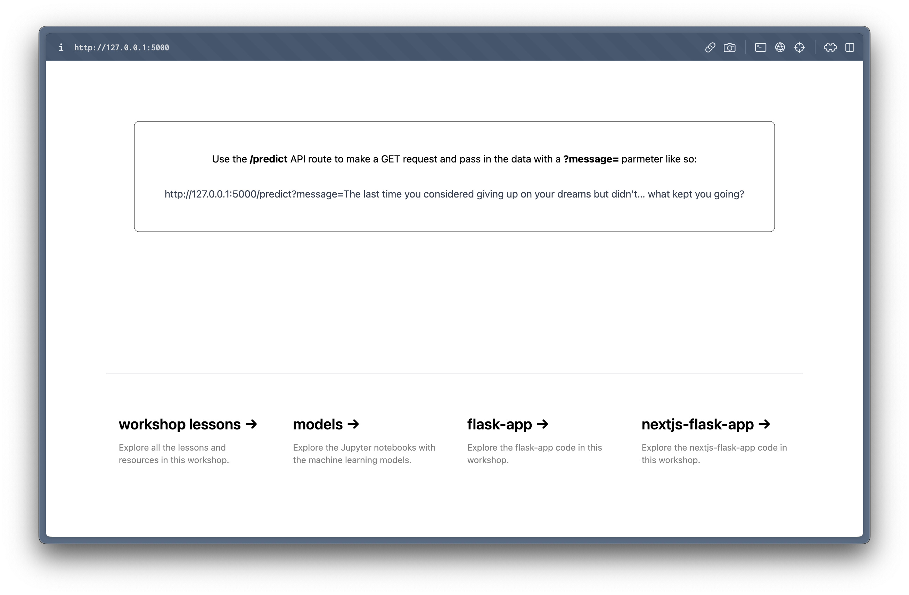

# Building an API for the ML Model

---

## Table of Contents

- [Overview](#overview)
- [Building the API](#building-the-api)
- [Testing the API with Postman](#testing-the-api-with-postman)

---

## Overview

In the last lesson, we serilized the pre-trained model using Pickle and saved them in the [`./model`](../model/) directory. Now, we're getting closer to deploying the model to the web for usage by end users. But before then, we need to build an application with an interface for users to access the model.

The end presentation layer of your machine learning model will vary based on the project's goals and model type. You can build a web, mobile, or embedded system (IoT) application (Raspberry Pi, Arduino, with cameras, speakers, etc.).

We will build an API and web application for this workshop to consume the API. In this lesson, we will discuss how to do that with Flask, HTML, TailwindCSS, and Javascript.

## Building the API

I'd assume you already installed all the required packages from the [prerequisites section](../README.md#🛠-prerequisites-and-installation-guide). The following steps outline the overview of the processes required to build an API with Flask:

1. In the `.env` file, add `FLASK_DEBUG=1`. This will allow us to run Flask in debug mode and automatically reload the server when changes are made to the code.

2. Create a new directory with the folder structure below (I did mine in [`./app/flask-api`](../app/flask-api/)):

```text
├── templates
    ├── main.html
├── app.py
├── .env

```

3. In the `main.html`, add the markup below (using TailwindCSS for styling). This is just a basic page to render quick instructions on how to use the API.

```html
<!DOCTYPE html>
<html lang="en">
  <head>
    <meta charset="UTF-8" />
    <meta http-equiv="X-UA-Compatible" content="IE=edge" />
    <meta name="viewport" content="width=device-width, initial-scale=1.0" />
    <title>MBPTI Personality Test Checker API</title>
    <link
      rel="shortcut icon"
      type="image/png"
      href="https://bolajiayodeji.com/favicon.png"
    />
    <link
      href="https://unpkg.com/tailwindcss@^2/dist/tailwind.min.css"
      rel="stylesheet"
    />
  </head>

  <body class="font-mono">
    <div class="flex items-center justify-center h-screen">
      <div
        class="p-12 max-w-xl bg-gray-200 rounded-lg overflow-hidden shadow-lg"
      >
        <div class="font-bold text-xl mb-2 text-center">
          MBPTI Personality Test Checker API
        </div>
        <hr class="border-1 border-black mb-8" />

          <div class="mt-12 text-center">
            <p>
            Use the /predict API route to make a GET request and pass in the data with a ?message=
            parmeter like so:
          </p>
          <br /><br />
          <a
            class="text-gray-700 text-center"
            href="http://127.0.0.1:5000/predict?message=The last time you considered giving up on your dreams but didn't… what kept you going?"
            >http://127.0.0.1:5000/predict?message=The last time you considered
            giving up on your dreams but didn't… what kept you going?</a
          >
        </div>
    </div>
  </body>
</html>
```

4. In the `app.py` file, add the code below to import the required packages, load the pre-trained model, and create a new route with the desired request methods.

```python
from flask import Flask, request, render_template, jsonify
import pickle

# Create an instance of the Flask class
# With the name of the application’s modules
# This way Flask knows where to look for templates, static files, etc.
app = Flask(__name__, template_folder='templates')

# Create the / API route and render the root HTML page
@app.route('/', methods=['GET'])
def main():
    return(render_template('main.html'))

# Create the /predict API route
@app.route('/predict', methods=['GET', 'POST'])
def predict():
    # Use pickle to load in vectorizer
    # with open() is a Python function that opens a file object
    # rb means read in binary
    # Learn more: https://docs.python.org/3/tutorial/inputoutput.html#reading-and-writing-files
    with open(f'../../model/two/vectorizer.pkl', 'rb') as f:
        vectorizer = pickle.load(f)

    # Use pickle to load in the pre-trained model
    with open(f'../../model/two/model.pkl', 'rb') as f:
        model = pickle.load(f)
    
    # Get the message from the API request (message parameter)
    message = request.args.get('message')

    if request.method == 'GET' and message != None:

        # A Python dictionary to store the 16 personality types
        # Based on the encoded values in the dataset
        mbpti_types = {
            0: "ENFJ (Extroversion, Intuition, Feeling, Judging)",
            1: "ENFP (Extroversion, Intuition, Feeling, Perceiving)",
            2: "ENTJ (Extroversion, Intuition, Thinking, Judging)",
            3: "ENTP (Extroversion, Intuition, Thinking, Perceiving)",
            4: "ESFJ (Extroversion, Sensing, Feeling, Judging)",
            5: "ESFP (Extroversion, Sensing, Feeling, Perceiving)",
            6: "ESTJ (Extroversion, Sensing, Thinking, Judging)",
            7: "ESTP (Extroversion, Sensing, Thinking, Perceiving)",
            8: "INFJ (Introversion, Intuition, Feeling, Judging)",
            9: "INFP (Introversion, Intuition, Feeling, Perceiving)",
            10: "INTJ (Introversion, Intuition, Thinking, Judging)",
            11: "INTP (Introversion, Intuition, Thinking, Perceiving)",
            12: "ISFJ (Introversion, Sensing, Feeling, Judging)",
            13: "ISFP (Introversion, Sensing, Feeling, Perceiving)",
            14: "ISTJ (Introversion, Sensing, Thinking, Judging)",
            15: "ISTP (Introversion, Sensing, Thinking, Perceiving)"
            }

        # Vectorize the passed messaage and make prediction
        prediction = model.predict(vectorizer.transform([message]))

        # The result is an array containing the predicted personality type number (e.g, [6])
        # Get the prediction text using the mbpti_types dictionary above
        # You can do this automatically by inverting the result
        # Like we did in the notebook using LabelEncoder().inverse_transform()
        # But you will need to fit the encoder first
        # To avoid working with the dataset again here, the mbpti_types dictionary above will suffice
        result = mbpti_types[prediction[0]]

        # Return the result as a JSON response
        data = {
            "message": message,
            "prediction": result
        }
        return jsonify(data)
    
    else :
        # Return an error message if:
        # no valid message parameter was provided
        # or the request method is not GET (e.g, POST)
        # Other request methods will return a different 405 error
        data = {
            "code": 400,
            "description": "Bad Request. No message was provided.",
            "message": "Use the message parameter to make a GET request."
        }
        return jsonify(data), 400

# Run the app
if __name__ == '__main__':
    app.run()

```

5. Now, use the command `flask run` to start the Flask server on `http://127.0.0.1:5000`.



6. If you head to `http://127.0.0.1:5000/predict`, you will get the error:


7. If you pass a `?message=` parameter to the URL (something like `http://127.0.0.1:5000/predict?message=The last time you considered giving up on your dreams but didn't… what kept you going?`), you will get the prediction result as a JSON response:


That's it! We will discuss more about the process during the workshop.

## Testing the API with Postman

If you've installed Postman, you can test the API easily with either the Desktop APP or VSCode Extension.


Now, we can use this API in our web application. After deploying the API, we can even use the API in other types of applications, too.

---

<div align="center">

Thank you for coming this far; you've done well 👏🏾. Please open a new GitHub discussion using the links below and let me know your thoughts about this lesson or any issues you're experiencing.

[Share Feedback](https://github.com/BolajiAyodeji/deploy-ml-web-workshop/discussions/new?category=feedback) | [Ask Question](https://github.com/BolajiAyodeji/deploy-ml-web-workshop/discussions/new?category=q-a)

---

<< [previous lesson](./02.md) | [next lesson](./04.md) >>

</div>
