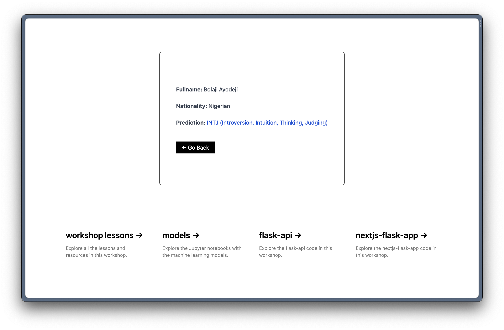

# Building a Web Application for the API

---

## Table of Contents

- [Overview](#overview)
- [Building the Web Application](#building-the-web-application)

---

## Overview

Now that we have a working API let's build a web application to consume the API. In this lesson, we will discuss how to do that with Flask, HTML, TailwindCSS, and Javascript.

We will build an HTML page with a form for the user to enter the required input variables; then, we will pass the input variables to the API for processing and return the predicted result to the user. Each input element has an `id` with the name of the feature required by the model. I added some extra elements (full name and country) that the model does not require to show you how to add more elements to the form.

## Building the Web Application

1. Create a `.env` file and add `FLASK_DEBUG=1`. This will allow us to run Flask in debug mode and automatically reload the server when changes are made to the code.

2. Create a new directory with the folder structure below (I did mine in [`app/flask-app`](../app/flask-app/)):

```text
├── model
├── static
    ├── countries.json
    ├── main.js
├── templates
    ├── 404.html
    ├── base.html
    ├── main.html
    ├── result.html
├── app.py
├── .env
```

3. Copy the `model.pkl` and `vectorizer.pkl` files in the root [`model/two`](../model/two/) directory to the newly created directory (`app/flask-app/model` in my case).

4. In the `app.py` file, add the code below (same as the last lesson, but we will make some changes for the form requests):

```python
from flask import Flask, request, redirect, url_for, render_template
import pickle

# Create an instance of the Flask class
# With the name of the application’s modules
# This way Flask knows where to look for templates, static files, etc.
app = Flask(__name__, template_folder='templates')

# Create the / API route and render the root HTML page
@app.route('/', methods=['GET'])
def main():
    return(render_template('main.html'))

# Create the /predict API route
@app.route('/predict', methods=['GET', 'POST'])
def predict():
    # Use pickle to load in vectorizer.
    # with open() is a Python function that opens a file object
    # rb means read in binary
    # Learn more: https://docs.python.org/3/tutorial/inputoutput.html#reading-and-writing-files
    with open(f'./model/vectorizer.pkl', 'rb') as f:
        vectorizer = pickle.load(f)

    # Use pickle to load in the pre-trained model.
    with open(f'./model/model.pkl', 'rb') as f:
        model = pickle.load(f)

    # Get the form responses from the API request
    if request.method == 'POST':
        name = request.form['name']
        country = request.form['country']
        message = request.form['message']

        # A Python dictionary to store the 16 personality types
        # Based on the encoded values in the dataset
        mbpti_types = {
            0: "ENFJ (Extroversion, Intuition, Feeling, Judging)",
            1: "ENFP (Extroversion, Intuition, Feeling, Perceiving)",
            2: "ENTJ (Extroversion, Intuition, Thinking, Judging)",
            3: "ENTP (Extroversion, Intuition, Thinking, Perceiving)",
            4: "ESFJ (Extroversion, Sensing, Feeling, Judging)",
            5: "ESFP (Extroversion, Sensing, Feeling, Perceiving)",
            6: "ESTJ (Extroversion, Sensing, Thinking, Judging)",
            7: "ESTP (Extroversion, Sensing, Thinking, Perceiving)",
            8: "INFJ (Introversion, Intuition, Feeling, Judging)",
            9: "INFP (Introversion, Intuition, Feeling, Perceiving)",
            10: "INTJ (Introversion, Intuition, Thinking, Judging)",
            11: "INTP (Introversion, Intuition, Thinking, Perceiving)",
            12: "ISFJ (Introversion, Sensing, Feeling, Judging)",
            13: "ISFP (Introversion, Sensing, Feeling, Perceiving)",
            14: "ISTJ (Introversion, Sensing, Thinking, Judging)",
            15: "ISTP (Introversion, Sensing, Thinking, Perceiving)"
        }

        # Vectorize the passed messaage and make prediction
        prediction = model.predict(vectorizer.transform([message]))

        # The result is an array containing the predicted personality type number (e.g, [6])
        # Get the prediction text using the mbpti_types dictionary above
        # You can do this automatically by inverting the result
        # Like we did in the notebook using LabelEncoder().inverse_transform()
        # But you will need to fit the encoder first
        # To avoid working with the dataset again here, the mbpti_types dictionary above will suffice
        result = mbpti_types[prediction[0]]

    # If the request method is not a POST request
    # E.g, accessing the /predict route manually (GET)
    # Redirect back to the main page
    else:
        return(redirect(url_for('main')))

    # Render the result page
    # Return the resulting data to the result page
    # This data will be handled in the result page
    return(render_template(
        'result.html', 
        name=name, 
        country=country, 
        result=result
        ))

# Catch 404 errors and render the 404 error page
@app.errorhandler(404)
def notFound(error):
    return render_template('404.html'), 404

# Run the app
if __name__ == '__main__':
    app.run()
```

5. In the `base.html` file, add the code below:

```html
<!DOCTYPE html>
<html lang="en">
  <head>
    <meta charset="UTF-8" />
    <meta http-equiv="X-UA-Compatible" content="IE=edge" />
    <meta name="viewport" content="width=device-width, initial-scale=1.0" />
    <!--Use the  Jinga syntax to pass in the dynamic title-->
    <!--Jinga is a fast, expressive, and extensible templating engine-->
    <!--Learn more: https://jinja.palletsprojects.com/en/3.1.x-->
    <title>
       MBPTI Personality Test Checker
    </title>
    <link
      rel="shortcut icon"
      type="image/png"
      href="https://bolajiayodeji.com/favicon.png"
    />
    <!--Import Tailwind CSS-->
    <script src="https://cdn.tailwindcss.com"></script>
  </head>

    <main class="flex min-h-screen flex-col items-center justify-between lg:p-24">
      <div
        class="p-12 mb-12 border border-black rounded-lg"
      >
        <!--Use the  Jinga syntax to pass in the dynamic content-->
        
      </div>
    </main>

    <!--Import the main.js file from the /static directory-->
    <script
      src="{{ url_for('static', filename='main.js') }}"
      type="text/javascript"
    ></script>
  </body>
</html>
```

6. In the `main.html` file, add the code below:

```html
<!--Use the  Jinga syntax to extend the base HTML markup-->



<!--Form starts here-->
<!--Set the id to "prediction-form"-->
<!--Set the action to "{{ url_for('predict') }}"-->
<!--This will use the /predict API route we have created-->
<!--Set the form method to POST-->
<form id="prediction-form" action="{{ url_for('predict') }}" method="POST">
  <div class="mb-4">
    <label class="block text-gray-700 text-sm font-bold mb-2" for="name">
      Fullname:
    </label>
    <!--Fullname input field with "name" name attribute-->
    <input
      name="name"
      id="name"
      type="text"
      class="block appearance-none w-full bg-white border border-gray-400 px-4 py-2 pr-8 shadow"
      required
    />
  </div>
  <div class="mb-4">
    <label class="block text-gray-700 text-sm font-bold mb-2" for="country">
      Country:
    </label>
    <!--Country select field with "country" name attribute-->
    <!--We will populate the <option> element using JavaScript in main.js-->
    <select
      id="country"
      name="country"
      class="block appearance-none w-full bg-white border border-gray-400 px-4 py-2 pr-8 shadow"
      required
    ></select>
  </div>
  <div class="mb-4">
    <label class="block text-gray-700 text-sm font-bold mb-2" for="message">
      Message:
    </label>
    <!--Message textarea field with "message" name attribute-->
    <textarea
      id="message"
      name="message"
      class="shadow appearance-none border w-full bg-white border border-gray-400 py-2 px-3 text-gray-700"
      rows="10"
      required
    ></textarea>
  </div>

  <!--Submit button-->
  <input
    type="submit"
    value="Submit"
    class="cursor-pointer w-full bg-black text-white font-bold mt-8 p-4 focus:outline-none focus:shadow-outline"
  />
</form>

```

7. In `main.js`, add the code below to populate the country select field with the list of countries in the [`countries.json`](../app/flask-app/static/countries.json) file:

```javascript
// Prevent the HTML form from storing state from the previous sessions
// If you refresh the /result page after a successful form submission
// The form will be empty, instead of trying to re-submit
if (window.history.replaceState) {
  window.history.replaceState(null, null, window.location.href);
}

// Append <option> with countries to the select element
const countries = "../static/countries.json";
const select = document.getElementById("country");

fetch(countries)
  .then((res) => res.json())
  .then((data) => {
    let option;
    for (let i = 0; i < data.length; i++) {
      option = document.createElement("option");
      option.text = data[i].en_short_name;
      option.value = data[i].nationality;
      select.add(option);
    }
  })
  .catch((err) => console.log(err));
```

8. In `result.html`, add the code below to display the result from the API:

```html
<!--Use the  Jinga syntax to extend the base HTML markup-->


<!--Use the  Jinga syntax to update the title-->
Result - 


<!--The variables in {{ }} represents the dynamic data expected upon successful form submission and processing-->
<div class="result mt-12">
  <p id="name" class="text-gray-700 font-bold">
    Fullname: <span class="font-medium">{{ name }}</span>
  </p>
  <br />
  <p id="country" class="text-gray-700 font-bold">
    Nationality: <span class="font-medium">{{ country }}</span>
  </p>
  <br />
  <p class="text-gray-700 font-bold">
    Prediction:
    <span class="text-blue-700 font-medium">{{ result }}</span>
  </p>
</div>
<div class="my-12">
  <a href="/" class="bg-black text-white py-2 px-4"> < Go Back </a>
</div>

```

9. In `404.html`, add the code below to display the 404 error page:

```html


404 - 


<div class="text-center m-24">
  <h1 class="text-6xl font-bold text-gray-900">404</h1>
  <p class="mt-2 text-2xl font-medium text-gray-600">Oops! Page not found.</p>
  <div class="mt-24">
    <a href="/" class="bg-black text-white py-2 px-4"> < Go Home </a>
  </div>
</div>

```

10. Now, use the command `flask run` to start the Flask server on `http://127.0.0.1:5000`.




That's it! We will discuss more about the process during the workshop.

---

<div align="center">

Thank you for coming this far; you've done well 👏🏾. Please open a new GitHub discussion using the links below and let me know your thoughts about this lesson or any issues you're experiencing.

[Share Feedback](https://github.com/BolajiAyodeji/deploy-ml-web-workshop/discussions/new?category=feedback) | [Ask Question](https://github.com/BolajiAyodeji/deploy-ml-web-workshop/discussions/new?category=q-a)

---

<< [previous lesson](./03.md) | [next lesson](./05.md) >>

</div>
